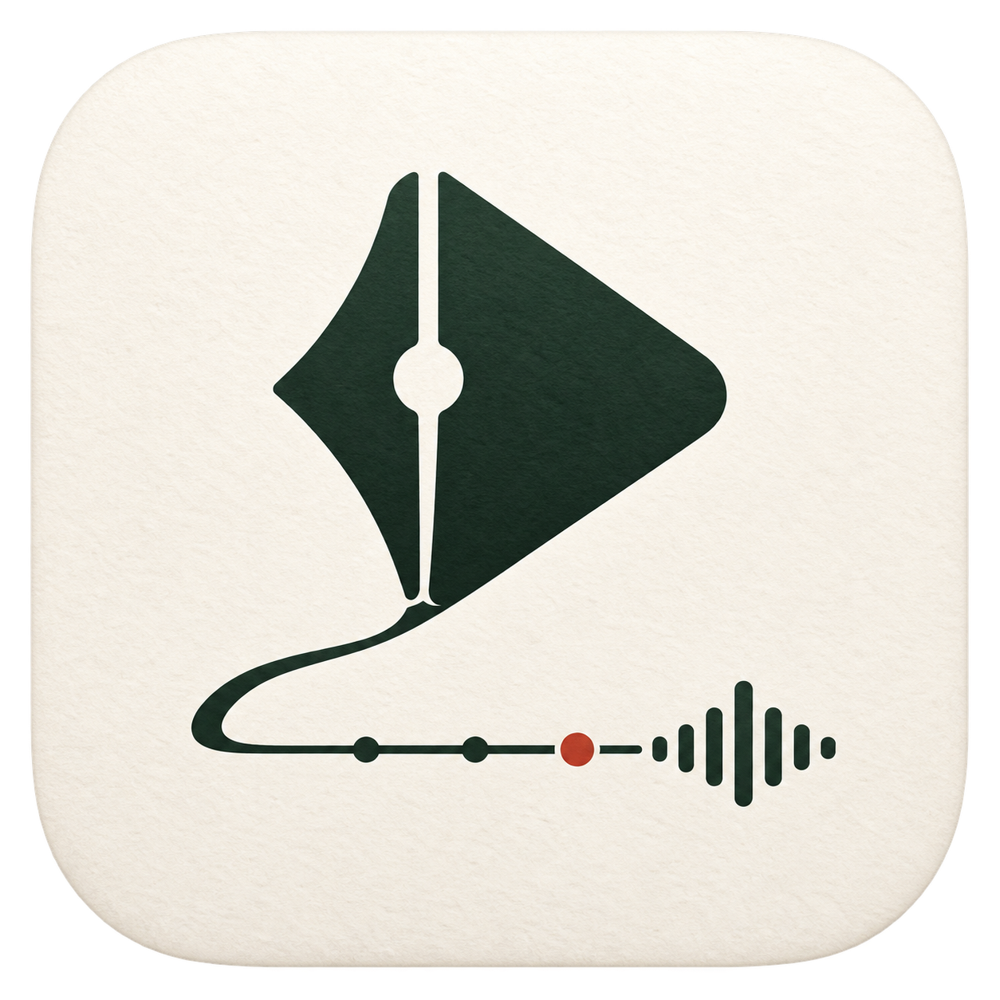

# Kairumo

手寫、打字、錄音轉文字 —— 在同一份文件、同一條時間軸上。

**免費 · 無帳號 · 無伺服器 · 資料在你自己的硬碟上。**

> 產品名稱：**Kairumo**。技術套件與開放格式暫保留 `padnote-*` / `.padnote`
> 命名，避免破壞既有 crate、文件格式與工具鏈相容性。



---

## 為什麼

市面上沒有任何一款產品同時做到一流手寫、一流文字編輯、一流錄音轉文字，
且對中文一視同仁、跨平台對等、資料開放、不靠訂閱綁架。

- Goodnotes 手寫最強，但**沒有錄音**，AI 至今**不支援中文**
- Notability 錄音最強，但轉錄慢又常失敗，且鎖 Apple 生態
- Granola 轉錄最好，但**沒有手寫**，且只有 Mac
- Obsidian 資料主權最好，但手寫與錄音都不是原生能力

完整分析見 [`docs/market-research.md`](docs/market-research.md)。

## 架構原則

1. **Local-first** — 所有操作先寫本機，斷網零功能損失
2. **No server truth** — 雲端只是啞檔案桶，不運算、不解析（內容已加密）
3. **Append-only** — 同步檔案只新增不修改，檔案衝突在數學上不可能發生
4. **Pluggable everything** — ASR、HWR、OCR、LLM、CloudProvider 全是 trait

## 文件

| 文件 | 內容 |
|---|---|
| [market-research.md](docs/market-research.md) | 全球前 10 款競品分析 |
| [architecture.md](docs/architecture.md) | 技術架構與已拍板決策 D1–D6 |
| [features.md](docs/features.md) | 完整功能表列與競品對照 |
| [roadmap.md](docs/roadmap.md) | M0–M4 階段執行計畫 |
| [format-spec.md](docs/format-spec.md) | **`.padnote` 公開格式規格** |
| [adr/](docs/adr/) | 架構決策紀錄 |

## 開發

```bash
cargo test --workspace
cargo clippy --workspace --all-targets
cargo deny check
```

## 格式開放承諾

`.padnote` 的完整規格公開於 [`docs/format-spec.md`](docs/format-spec.md)。
任何人都能自行解析筆畫、文字與轉錄內容，不需要 Kairumo 程式。
這是技術契約，破壞相容性需經 ADR。

## 授權

Apache-2.0
